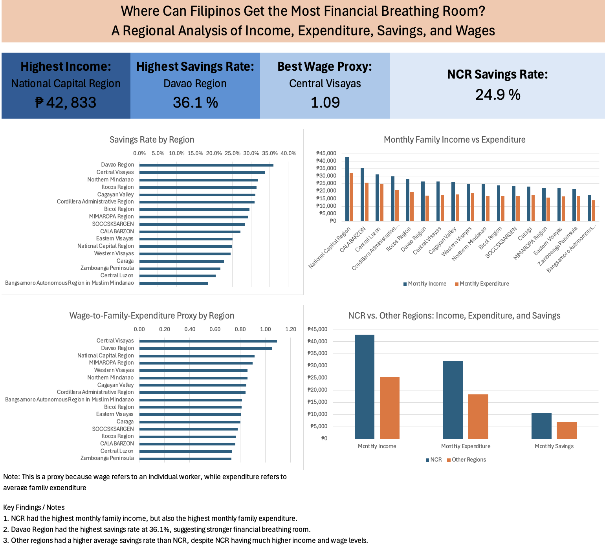
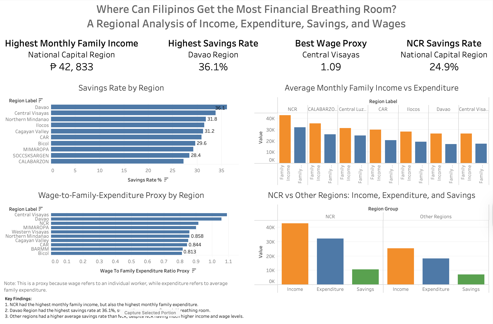

# Where Can Filipinos Get the Most Financial Breathing Room?

## Project Overview

This project analyzes regional income, expenditure, savings, and wage data in the Philippines to explore which regions may provide the most financial breathing room for Filipino households and workers.

The main question explored in this project is:

**Does having a higher income automatically mean having better financial breathing room?**

Using regional datasets from the Philippine Statistics Authority (PSA), this project compares average monthly family income, average monthly family expenditure, average monthly family savings, savings rates, and wage-related affordability indicators across Philippine regions.

## Motivation

As a fresh graduate preparing to enter the workforce, I wanted to better understand how salary and cost of living differ across Philippine regions. Metro Manila is often associated with higher salaries, but it also has higher expenses. This project investigates whether higher income always leads to better affordability, or whether some regions outside NCR may offer stronger financial breathing room.

## Data Sources

This project uses publicly available datasets from the Philippine Statistics Authority (PSA):

* Family Income and Expenditure Survey (FIES)
* Occupational Wages Survey (OWS)

Main datasets used:

* 2023 FIES regional income, expenditure, and savings data
* 2024 OWS regional average monthly wage data

## Tools Used

* Excel — data cleaning, transformation, and dashboard creation
* SQL / SQLite — data analysis and querying
* Tableau — dashboard visualization
* GitHub — project documentation and portfolio presentation

## Data Cleaning and Preparation

The raw datasets were cleaned and transformed before analysis.

Main cleaning steps included:

1. Removed blank rows, title rows, notes, and non-region rows.
2. Standardized region names using a region lookup table.
3. Converted annual income, expenditure, and savings values into monthly values.
4. Converted values expressed in thousands of pesos into actual peso values.
5. Joined 2023 FIES data with 2024 OWS wage data by region.
6. Created calculated metrics such as savings rate, income-to-expenditure ratio, and wage-to-family-expenditure proxy.

## Key Metrics

The main metrics used in this project are:

* Average Monthly Family Income
* Average Monthly Family Expenditure
* Average Monthly Family Savings
* Savings Rate
* Income-to-Expenditure Ratio
* Wage-to-Family-Expenditure Proxy

The wage-to-family-expenditure proxy compares average monthly wage with average monthly family expenditure. This should be interpreted carefully because wage data refers to individual workers, while expenditure data refers to families.

## Key Findings

1. NCR had the highest average monthly family income, but it also had the highest average monthly family expenditure.
2. Davao Region had the highest savings rate at 36.1%, suggesting stronger financial breathing room compared with other regions.
3. Central Visayas had the highest wage-to-family-expenditure proxy, indicating that its average wage was strongest relative to average family expenditure among the regions analyzed.
4. Other regions had a higher average savings rate than NCR, despite NCR having much higher income and wage levels.
5. Higher income does not automatically translate to better financial breathing room when expenses are also high.

## Excel Dashboard



## Tableau Dashboard



## SQL Analysis

The SQL analysis includes queries answering questions such as:

* Which regions have the highest monthly family income?
* Which regions have the highest monthly family expenditure?
* Which regions have the highest savings rate?
* Which regions have the strongest income-to-expenditure ratio?
* Which regions have the strongest wage-to-family-expenditure proxy?
* How does NCR compare with other regions?

SQL file:

```text
sql/01_affordability_analysis.sql
```

## Project Files

```text
data/clean/
/clean_fies.csv
/clean_ows_table.csv
/region_lookup.csv
/analysis_region_affordability.csv

excel/
/ph_affordability_project_working.xlsx

sql/
/01_affordability_analysis.sql

tableau/
/ph_affordability_dashboard.twbx

images/
/excel_dashboard.png
/tableau_dashboard.png
```

## Limitations

This project uses 2023 FIES data and 2024 OWS data because these were the latest available datasets used for the analysis. Since the datasets come from different years, the results should be interpreted as an approximate regional affordability comparison rather than an exact real-time cost-of-living measure.

Additionally, the wage-to-family-expenditure proxy compares individual wage data with family expenditure data, so it should be treated as a supporting indicator rather than a direct affordability measure.

## Conclusion

The analysis suggests that regional affordability should not be evaluated based on income alone. NCR had the highest income and wage levels, but other regions showed stronger savings rates and potentially better financial breathing room. For workers and fresh graduates evaluating employment opportunities, both income and expected expenses should be considered.
